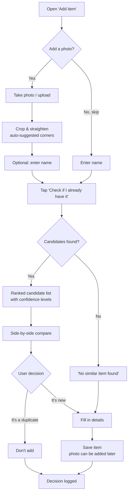
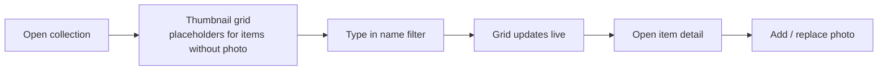

# Sugar Bag Collection Organizer — Requirements

| | |
|---|---|
| **Document** | Product & Technical Requirements |
| **Version** | 0.2 (draft) |
| **Status** | For review |
| **Related** | `02-architecture.md` |

### Change log

| Version | Changes |
|---|---|
| 0.1 | Initial draft. |
| 0.2 | Photo is optional on items (FR-01). Photo side tag is optional (FR-02). "Copies owned" moved to post-MVP (FR-27). Onboarding/import requirements (FR-40..42) moved to *Could*. Open questions resolved and moved to §10 *Decisions*. PWA confirmed as the Android solution for MVP. Bulk import removed from the roadmap for now. New requirements for items without photos (FR-07, FR-16, FR-32). |

---

## 1. Background & Problem Statement

The owner collects sugar bags (single-serving sugar packets from cafés, restaurants, hotels, airlines). The collection exceeds **1,000 items** and keeps growing. When a new bag is found, it is hard to tell whether it is already in the collection. Memory and manual browsing do not scale.

**Goal:** a collection organizer whose headline feature is: *take a photo of a sugar bag → instantly see whether I already have it.*

### 1.1 Why this is hard (and why it matters for the design)

- Photos of the **same** bag look different: lighting, angle, background, reflections, crumpled paper, partial occlusion by fingers.
- **Different** bags can look very similar: same brand, same café chain, a series with only a changed number, colour variant or small text difference.
- Bags have **two sides** (front/back), and sometimes only the back distinguishes two items.
- Some bag shapes are square, some are long "sticks".
- Not every item in the collection will have a photo; for those, only the name can be matched.

The system must therefore be robust to photo conditions **and** sensitive to small design differences. Because of the second point, the system **suggests** duplicates; the **user always makes the final decision** (human-in-the-loop). What counts as "the same item" (e.g. same design in a different size or material) is the user's call, not the system's.

---

## 2. Users & Personas

| Persona | Description | Priority |
|---|---|---|
| **Owner / Collector** | Single user, owns the collection, adds items (often on the go with a phone), browses at home. | MVP |
| **Fellow collectors** | Other hobbyists with their own collections (sugar bags, coasters, matchbox labels, stickers…). | Future (SaaS option) |
| **Visitors** | Read-only access to a public/shared collection. | Future |

---

## 3. Scope

### 3.1 In scope (MVP)
- Item catalogue with optional photos (CRUD).
- Browse and filter the collection by name.
- Add a new item, with or without photo(s).
- **"Check if I already have it"** — duplicate detection primarily by image, secondarily by name.
- Confirm / decline adding the item after reviewing candidates.
- Web application, mobile-friendly and installable on Android as a **PWA** (used from a phone in place of a native app).

### 3.2 Out of scope (MVP) — planned later
- Native Android app (Phase 2), iOS app (Phase 3).
- Tracking the number of physical copies owned (spares for trading).
- Multi-user / sharing / trading features.
- Offline mode.

### 3.3 Not planned (for now)
- Bulk import of the existing collection (batch upload, sheet scanning). The existing collection is entered gradually through the normal "Add item" flow.

---

## 4. Functional Requirements

Priorities use MoSCoW: **M** = Must, **S** = Should, **C** = Could, **W** = Won't (for now).

### 4.1 Item management

| ID | Requirement | Priority |
|---|---|---|
| FR-01 | The user can create an item with a **name** (required) and an optional **description**. **Photos are optional**: an item can be saved without any photo, and photos can be added later or never. | M |
| FR-02 | An item can have multiple photos. Each photo **may optionally** be tagged with a side (`Front`, `Back`, `Other`); untagged photos are allowed. | M |
| FR-03 | Optional metadata fields: brand/venue, country, city, year acquired, source (where found), tags, notes. | S |
| FR-04 | The user can edit and delete items, and add or remove photos at any time. | M |
| FR-05 | Deleting an item is a soft delete (recoverable for 30 days). | C |
| FR-06 | Photos are stored in original quality plus a generated thumbnail. | M |
| FR-07 | Items without a photo show a clear placeholder in lists and detail views. | M |

### 4.2 Browsing & filtering

| ID | Requirement | Priority |
|---|---|---|
| FR-10 | The user can view the collection as a grid of thumbnails with names. | M |
| FR-11 | The user can **filter by name** (case-insensitive, partial match, diacritics-insensitive, e.g. "cafe" finds "Café"). | M |
| FR-12 | Results are paginated or infinitely scrolled; the grid stays responsive with 10,000+ items. | M |
| FR-13 | Filter by metadata (country, brand, tags) and sort (name, date added). | S |
| FR-14 | Item detail view shows all photos full-size with zoom. | M |
| FR-15 | "Search by photo" from the browse screen (same engine as duplicate check, without adding an item). | S |
| FR-16 | Filter "items without photo", so the user can complete them over time. | S |

### 4.3 Adding an item & duplicate check (core feature)

| ID | Requirement | Priority |
|---|---|---|
| FR-20 | In the "Add item" flow the user can take a photo with the device camera or upload a file. This step can be skipped. | M |
| FR-21 | The user can **crop / straighten** the photo (drag 4 corners, like a document scanner). The app pre-suggests the corners automatically when possible. | S (M for good accuracy) |
| FR-22 | A prominent button **"Check if I already have it"** runs duplicate detection. It is enabled when a **photo, a name, or both** are provided; the photo is the primary signal, the name secondary. | M |
| FR-23 | The check returns a ranked list of **up to 10 candidates**, each with thumbnail (or placeholder), name and a **confidence level**: *Very likely the same*, *Similar*, *Weak match*. | M |
| FR-24 | If no candidate exceeds the minimum threshold, the app states clearly: *"No similar item found in your collection."* | M |
| FR-25 | The user can open a **side-by-side comparison** (new photo vs. candidate photo) with synchronized zoom. | M |
| FR-26 | The user decides: **"It's a duplicate — don't add"** or **"It's new — add to collection"**. The system never decides on its own; e.g. whether a different size or material counts as a new item is entirely up to the user. | M |
| FR-27 | If marked as duplicate, the user can increase a **"copies owned"** counter on the existing item (spares for trading). | W (post-MVP) |
| FR-28 | If marked as duplicate, the user can attach the new photo to the existing item (e.g. a better photo, or the first photo of an item that had none). | C |
| FR-29 | The check may be run with front and back photos; matching uses all photos of every item, tagged or not (best match wins). | S |
| FR-30 | Each user decision (confirmed duplicate / declined) is logged to improve thresholds and evaluate accuracy. | S |
| FR-31 | Name similarity contributes to the score (fuzzy matching, typo-tolerant). | M |
| FR-32 | Items **without photos** take part in the check through name matching only. Such candidates are marked "matched by name only — no photo". | M |
| FR-33 | Text printed on the bag is read automatically (OCR) and used as an additional matching signal. | C |

### 4.4 Collection onboarding & data portability

Not part of the MVP; the existing collection is entered via the normal "Add item" flow.

| ID | Requirement | Priority |
|---|---|---|
| FR-40 | Bulk upload of many photos at once, creating draft items (name can be filled in later). | C |
| FR-41 | Upload a scan/photo of a sheet with many bags and have it auto-split into individual items. | C |
| FR-42 | Import/export the catalogue as CSV + ZIP of photos (backup, portability). | C |

### 4.5 Accounts

| ID | Requirement | Priority |
|---|---|---|
| FR-50 | The collection is private and requires sign-in. | M |
| FR-51 | The data model supports multiple users/collections from day one (even if only one user exists). | M |

---

## 5. Non-Functional Requirements

| ID | Category | Requirement |
|---|---|---|
| NFR-01 | **Accuracy** | For a photo of an item already in the collection **that has a photo**, the correct item appears in the **top 5 candidates in ≥ 95%** of cases (Recall@5), measured on a test set (see §7). |
| NFR-02 | **Accuracy** | The correct item is ranked **#1 in ≥ 85%** of cases (Recall@1), same conditions as NFR-01. |
| NFR-03 | **Performance** | Duplicate check completes in **≤ 3 s** (p95) for a collection of 10,000 items, excluding upload time. |
| NFR-04 | **Performance** | Browse/filter responses ≤ 500 ms (p95). |
| NFR-05 | **Scalability** | Designed for 10,000 items per collection without architectural changes; 100,000 with minor changes. |
| NFR-06 | **Usability** | The "add + check" flow is completable one-handed on a phone in under 30 seconds. |
| NFR-07 | **Portability** | MVP: responsive web app installable as a PWA on Android. Later: native Android and iOS apps reusing the web UI and client logic. |
| NFR-08 | **Cost** | Hobby-scale hosting target: **low tens of USD/EUR per month** on Azure (see architecture doc). |
| NFR-09 | **Data safety** | Daily backups of database and photos. |
| NFR-10 | **Security** | HTTPS only; photos not publicly accessible (time-limited access URLs). |
| NFR-11 | **Privacy** | Uploaded photos may contain people/places in the background; they are never shared with third parties beyond the chosen cloud processing services. |
| NFR-12 | **Licensing** | All libraries and ML models must have licenses allowing commercial use (in case the app becomes a product). |
| NFR-13 | **Maintainability** | Primary backend language C# / .NET; ML components behind interfaces so algorithms can be swapped. |

---

## 6. Key User Flows

### 6.1 Add a new item with duplicate check

### 6.2 Browse & filter

---

## 7. Acceptance Criteria for the Duplicate Check

Accuracy must be **measured, not guessed**. Before release:

1. Build a **test set**: pick ~100 bags that are in the collection with photos and photograph each **a second time** under different conditions (other lighting, angle, background, phone). Include ~20 "tricky pairs" (same brand, different design) and ~20 bags **not** in the collection.
2. Run every test photo through the check against the full collection.
3. Measure:
   - **Recall@1 / Recall@5** for bags that are in the collection (targets: NFR-01, NFR-02).
   - **False "Very likely the same"** rate for bags not in the collection and for tricky pairs (target: < 5%).
4. Separately verify that name-only checks (no photo) find items by name with typos and missing diacritics.
5. Re-run the evaluation automatically whenever the algorithm, model or thresholds change (regression test).

---

## 8. Release Phases

| Phase | Content |
|---|---|
| **0 — Spike (1–2 weeks)** | Prove the algorithm: script that embeds ~200 photos and measures Recall@5 on re-photographed bags. Go/no-go decision. |
| **1 — MVP (web + PWA)** | CRUD with optional photos, name filter, duplicate check (image embeddings + name), crop tool, sign-in. Installable PWA used on Android. |
| **1.1 — Accuracy** | Geometric re-ranking, front/back matching, OCR signal, decision logging, threshold tuning. |
| **2 — Native Android** | Native Android app replacing the PWA; "copies owned" counter (FR-27). |
| **3 — iOS & beyond** | iOS app; optional multi-user / public profiles / other collectible types. Import/export (FR-40..42) re-evaluated here. |

---

## 9. Business Considerations

- **Onboarding happens gradually.** With no bulk import, the duplicate check only knows about bags that have been entered with a photo. Early on, many real duplicates will be invisible to the photo matcher. Two cheap mitigations within the MVP: entering a name lets name-only matching cover items without photos (FR-32), and the "items without photo" filter (FR-16) helps complete the catalogue over time. It's worth tracking the share of items with photos as a simple progress indicator.
- **Market beyond one user.** The same problem exists for many flat collectibles: beer coasters, matchbox labels, stickers, postcards, tea bag envelopes, stamps, trading cards. A generic "flat collectibles organizer with duplicate check" is a plausible niche product. Keeping the data model multi-tenant (FR-51) and the item type generic keeps this door open at almost no cost. For a multi-user product, bulk import would likely become important again.
- **Possible monetization later:** free tier with an item limit, paid tier for unlimited items / multiple collections; trade lists ("my spares", based on FR-27) between collectors as a community feature.
- **Keep cost low:** the ML is designed to run on cheap CPU hosting without paid AI APIs for the core feature (see architecture document).

---

## 10. Decisions

Resolved questions from v0.1:

| # | Question | Decision |
|---|---|---|
| D-1 | Track spare copies as a count on one item? | Not in MVP; yes later (FR-27, Phase 2). |
| D-2 | Is "same design, different size/material" one item or two? | Up to the user; the system only suggests (FR-26). |
| D-3 | Other commonly tracked fields (catalogue numbers, series, manufacturer)? | None known; the metadata in FR-03 is sufficient. Free-form tags cover edge cases. |
| D-4 | Is a PWA good enough for Android? | Yes for MVP; native Android app later (Phase 2). |
| D-5 | Bulk import / scanner onboarding? | No bulk import for now; items are added one by one (§3.3). |

---

## 11. Glossary

| Term | Meaning |
|---|---|
| **Item** | One distinct sugar bag design in the collection, as defined by the user. |
| **Candidate** | An existing item suggested as a possible duplicate. |
| **Embedding** | A numeric vector summarizing an image's visual content; similar images have nearby vectors. |
| **Recall@K** | Share of checks where the true match appears within the top K candidates. |
| **Geometric verification** | Confirming a match by finding the same distinctive points in both images in a consistent spatial arrangement. |
| **PWA** | Progressive Web App: a web app that can be installed on a phone's home screen and used like an app. |
