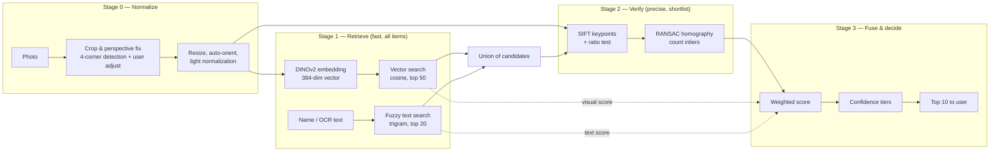
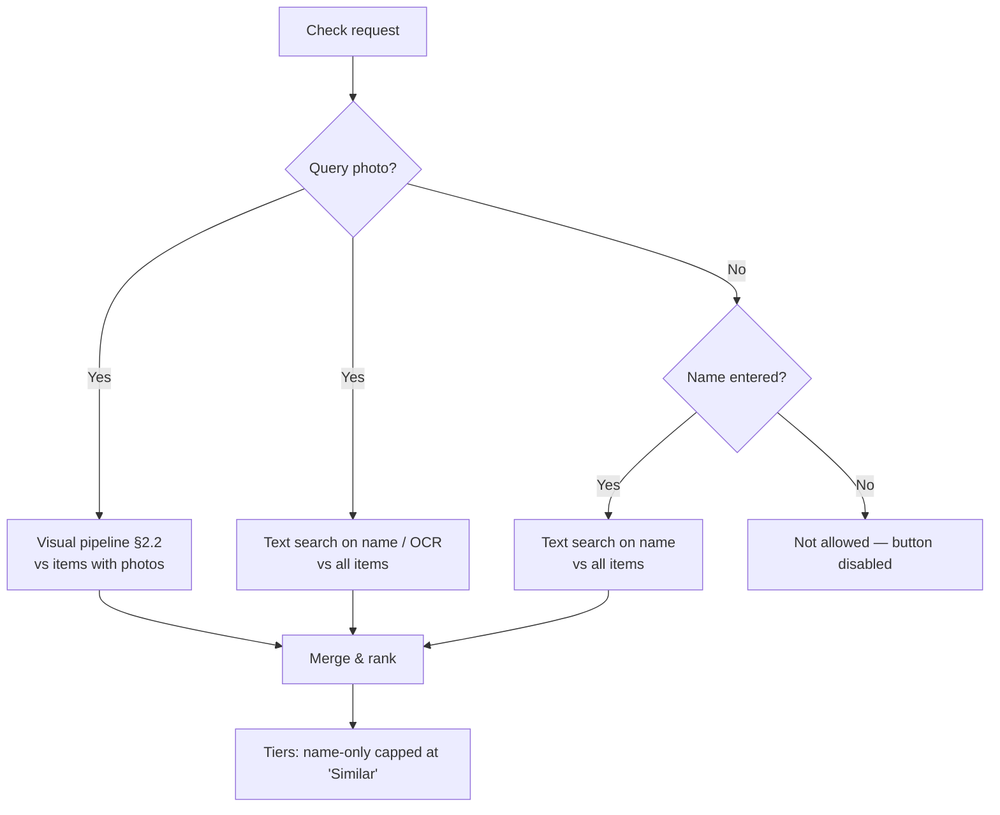
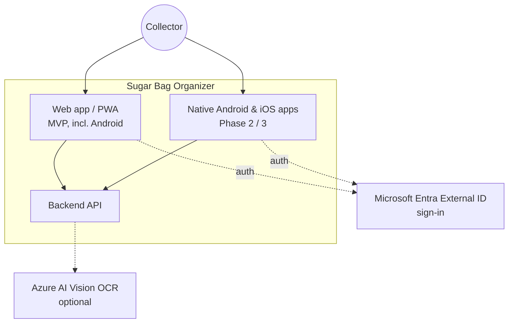
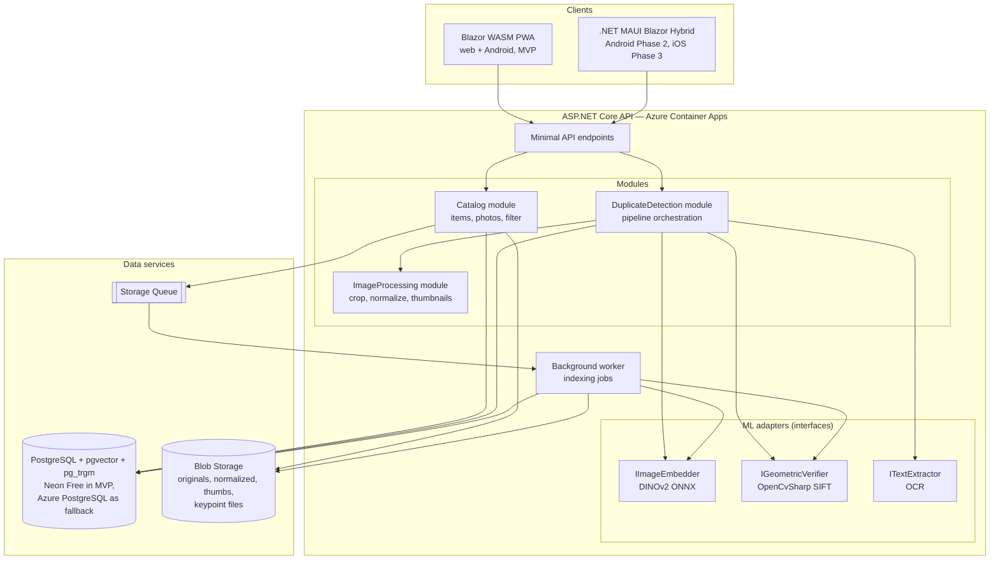
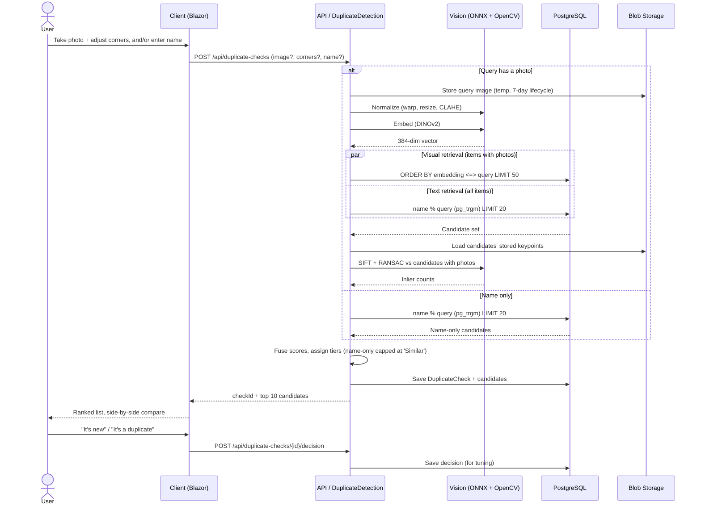
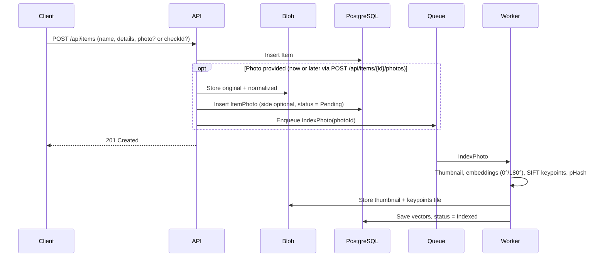
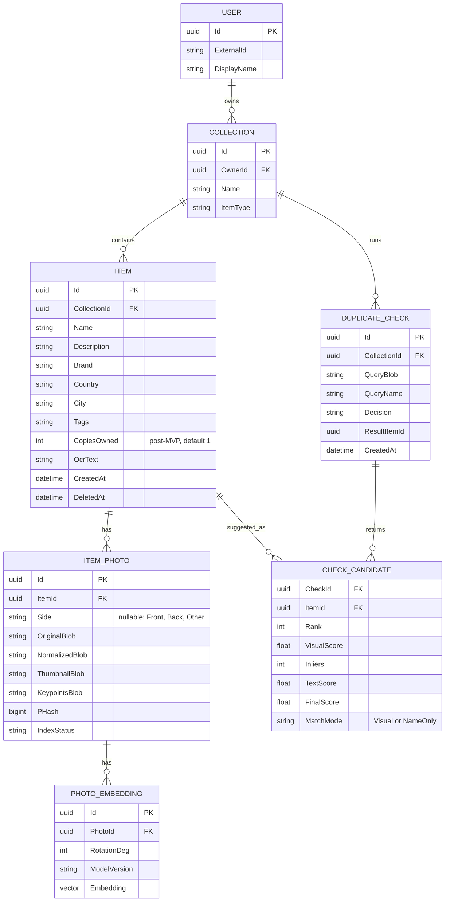
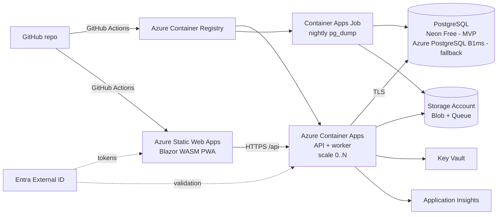

# Sugar Bag Collection Organizer — Architecture

| | |
|---|---|
| **Document** | Solution Architecture |
| **Version** | 0.4 (draft) |
| **Status** | For review |
| **Related** | `01-requirements.md` (v0.2) |

### Change log

| Version | Changes |
|---|---|
| 0.1 | Initial draft. |
| 0.2 | Aligned with requirements v0.2: photos optional on items, photo side optional, name-only duplicate check (§2.4), PWA as the Android client for MVP with native MAUI app in Phase 2, bulk import and export removed from MVP/roadmap, "copies owned" marked post-MVP. Updated sequences, data model, API, ADRs (new ADR-08), risks and build order. |
| 0.3 | Added the "photograph the front side first" hint in the add-item screen (§2.2 Stage 0, build order). |
| 0.4 | Database hosting: **Neon Free for the MVP, Azure Database for PostgreSQL as paid fallback** (new §8.1, ADR-09). Nightly `pg_dump` backup job to Blob Storage, no HNSW index in the MVP, database-size monitoring. Cost estimate rewritten from checked pricing (now includes Container Registry). New risks, updated build order. |

---

## 1. Architecture Goals

1. **Accurate duplicate detection** on real phone photos (the product's reason to exist).
2. **C# / .NET end-to-end** where reasonable; ML behind interfaces so it can be swapped.
3. **One UI codebase** for web, Android and iOS: a PWA in the MVP, native apps later.
4. **Photos are optional**: every feature must work for items with no photo (falling back to name matching).
5. **Cheap to run** on Azure at hobby scale; able to grow into a multi-user product.
6. **Simple first**: a modular monolith, not microservices.

---

## 2. Duplicate Detection Algorithm (core)

### 2.1 Options considered

| Approach | How it works | Strengths | Weaknesses | Verdict |
|---|---|---|---|---|
| **Perceptual hash** (pHash/dHash) | 64-bit fingerprint of a downscaled image | Tiny, very fast | Breaks with different angle, background, lighting — only finds near-identical *files* | ❌ Not sufficient alone |
| **Colour histograms** | Compare colour distributions | Trivial | Many bags share colour schemes | ❌ |
| **Local features + geometric verification** (SIFT / ORB / AKAZE + RANSAC) | Find distinctive points in both images and check they align via a homography | Excellent for **flat printed objects**; detects tiny design differences; robust to rotation/perspective | Too slow to compare against every item; weaker on crumpled/glossy bags | ✅ As **re-ranker** |
| **Deep global embeddings** (DINOv2, CLIP, SigLIP) | Neural network turns each image into a vector; nearest vectors = most similar images | Robust to lighting/background/angle; fast search over thousands of items | May rank "same brand, different design" too close | ✅ As **retriever** |
| **OCR text matching** | Read printed text, compare strings | Strong signal for brand/venue names | Stylized fonts, small text, OCR errors | ✅ As **supporting signal** |
| **Managed API** (Azure AI Vision multimodal embeddings) | Cloud service returns image vectors | No model hosting | Per-call cost, regional availability, vendor lock-in | ⚪ Alternative to self-hosted embeddings |

### 2.2 Recommendation: a hybrid "retrieve → verify → fuse" pipeline

This is the standard approach used in large-scale image retrieval (landmark recognition, product search): a fast global search to shortlist candidates, then precise but expensive verification on the shortlist.



#### Stage 0 — Normalization (biggest single accuracy win)
- Most error comes from **background and perspective**, not from the matching algorithm. Isolating the bag first matters more than picking the "best" model.
- Sugar bags are flat and mostly rectangular → use the **document-scanner technique**: edge detection → largest quadrilateral contour → perspective warp to a flat rectangle (OpenCV `Canny`, `FindContours`, `ApproxPolyDP`, `WarpPerspective`).
- Show the detected corners in the UI and let the user drag them if wrong (FR-21). Store both the original and the normalized image.
- Normalize: max side 1024 px, fix EXIF rotation, mild contrast normalization (CLAHE).
- Rotation: a bag may be photographed upside down. At indexing time, store embeddings for the image rotated **0° and 180°** (and 90°/270° for square bags); take the best score. Cheap and effective.
- **Front side first (UI hint):** the add-item and check screens show the hint *"Photograph the front side of the bag"* above the camera button. Visual matching works best when every item's first photo shows the same side. The hint is guidance only; the side tag stays optional and nothing is enforced.

#### Stage 1 — Candidate retrieval
- **Model: DINOv2 ViT-S/14** (Meta, Apache-2.0 license, 384-dim output). DINOv2 is trained self-supervised and is notably better than CLIP at *instance-level* similarity ("this exact object") rather than *semantic* similarity ("a sugar packet"). Upgrade to ViT-B/14 (768-dim) if the spike shows it's needed.
- Run via **ONNX Runtime in .NET** (model exported to ONNX; community exports exist on Hugging Face, or export with `optimum`). CPU inference is roughly 100–300 ms per image — fine for this use case.
- Preprocessing: resize/center to 224×224, ImageNet mean/std normalization; take the CLS token, **L2-normalize**.
- Search: cosine similarity, top 50, across **all photos of every item**, whether or not they are tagged with a side (best match per item wins). At 10k items × 4 rotations × 2 photos ≈ 80k vectors × 384 floats ≈ 120 MB — can be brute-forced in milliseconds; a vector index (pgvector HNSW) is only an optimization. **The MVP does not create one**: it is not needed at this size, and the index would use extra storage on the 0.5 GB Neon Free limit (§8.1).
- In parallel: **fuzzy name search** (PostgreSQL `pg_trgm` trigram similarity + `unaccent`) on the entered name and on OCR text (later).

#### Stage 2 — Geometric verification (re-ranking)
- For each shortlisted candidate: **SIFT** keypoints (patent expired 2020, in OpenCV main) → k-NN matching with Lowe's ratio test (0.75) → `FindHomography` with RANSAC → **number of inliers**.
- Same printed design → typically dozens to hundreds of consistent inliers. Similar-but-different design → few, inconsistent matches. This is what separates "Café Nero #3" from "Café Nero #4".
- Precompute and store keypoints/descriptors for every collection photo (so only the query image is processed at check time). Limit to ~1,000 keypoints per image.
- 50 candidates × ~20 ms ≈ 1 s on CPU — within budget (NFR-03).
- Future upgrade path: **SuperPoint + LightGlue** (learned features, better on glossy/crumpled bags), also runnable via ONNX.

#### Stage 3 — Score fusion & confidence tiers
Starting point (to be calibrated on the test set from requirements §7):

```
visual    = cosine similarity (best over rotations/sides), rescaled to 0..1
geometric = min(inliers / 50, 1.0)
text      = trigram similarity of name/OCR, 0..1 (0 if no name entered)

score = 0.45 * visual + 0.45 * geometric + 0.10 * text
```

This formula applies when **both** the query and the candidate have a photo. The other combinations are covered in §2.4.

| Tier | Initial rule | UI label |
|---|---|---|
| High | inliers ≥ 40 **or** score ≥ 0.80 | 🟢 Very likely the same |
| Medium | score 0.60–0.80 | 🟡 Similar — please compare |
| Low | score 0.45–0.60 | ⚪ Weak match |
| — | below 0.45 | not shown |

> **Principle:** the algorithm optimizes for *recall* (never miss a real duplicate); the side-by-side comparison lets the human handle precision. A false "similar" costs the user two seconds; a missed duplicate defeats the app's purpose.

#### Learning from decisions
Every confirm/decline is stored (`DuplicateCheckDecision`). After a few hundred decisions, fit the weights and thresholds with a simple logistic regression — no deep learning required. Later, the logged pairs could fine-tune the embedding model.

### 2.4 Missing photos: matching modes

Photos are optional (requirements FR-01), and many items in the collection will have no photo for a long time because there is no bulk import. The check therefore chooses a **matching mode per query–candidate pair**:

| Query has | Candidate has | Mode | Signals used | Max tier shown |
|---|---|---|---|---|
| Photo | Photo | **Visual** | visual + geometric + text (§2.2 formula) | 🟢 Very likely the same |
| Photo | No photo | **Name only** | text (entered name and, later, OCR text of the query photo) | 🟡 Similar |
| Name only | Photo or no photo | **Name only** | text | 🟡 Similar |
| Neither | — | — | Button disabled (FR-22) | — |

Rules for name-only candidates:
- Score = trigram similarity of the names (with `unaccent`, lowercase); show if ≥ 0.35 (to be calibrated).
- **Never** shown as "Very likely the same": a name alone cannot prove the design is identical (same café, different designs is common). The highest tier is "Similar".
- The candidate is labelled **"Matched by name only — no photo"** (FR-32), and the comparison view shows the candidate's placeholder plus its description and metadata instead of a photo.
- Name-only and visual candidates are merged into one list, sorted by score. Visual matches with geometric confirmation are ranked above name-only matches with the same score.



**Consequence for accuracy:** the NFR-01/NFR-02 targets apply only to items that have a photo. Showing "X % of your collection has photos" in the UI is a simple way to make the remaining blind spot visible and encourage adding photos over time.

### 2.3 Libraries

| Purpose | Library | License | Notes |
|---|---|---|---|
| Model inference | **Microsoft.ML.OnnxRuntime** | MIT | CPU; GPU optional |
| Computer vision | **OpenCvSharp4** | Apache-2.0 | Preferred over Emgu CV, which is **GPL/commercial dual-licensed** |
| Image loading/resizing | **SixLabors.ImageSharp** | Six Labors Split License | Check terms if revenue grows; OpenCvSharp can cover this too |
| Vectors in EF Core | **Pgvector.EntityFrameworkCore** | MIT | |
| Embedding model | **DINOv2 ViT-S/14** | Apache-2.0 | |
| OCR (phase 1.1) | Azure AI Vision Read / Tesseract | Commercial API / Apache-2.0 | Free tier of Azure OCR likely enough |

---

## 3. System Context



---

## 4. Container / Component View

### 4.1 Client: one Blazor UI for all platforms

**Recommendation:** Blazor, with shared components in a Razor Class Library.

- **Web + Android (MVP):** Blazor WebAssembly, installable as a **PWA**. This is the Android client for the MVP: the user installs it to the home screen. Camera capture works in mobile browsers (`<input type="file" accept="image/*" capture="environment">`).
- **Native Android (Phase 2) / iOS (Phase 3):** **.NET MAUI Blazor Hybrid** hosts the *same* Razor components natively, adding native camera, file system and offline storage. Building the UI as a Razor Class Library from day one makes this a packaging step rather than a rewrite.
- Keep platform-specific code (camera, file picking) behind small interfaces such as `ICameraService`, with a browser implementation now and a MAUI implementation later.
- Result: C# everywhere, one UI codebase, no JavaScript framework to learn.

*Alternative considered:* React/Next.js + React Native — larger ecosystem and more polished mobile UI, but two languages and two UI codebases. Choose this only if UI polish becomes more important than staying in C#.

### 4.2 Backend: modular monolith



**Why a modular monolith:** a single deployable is cheapest and simplest to run. Modules have clear boundaries, so the ML part can later be split into its own service (e.g. a Python/GPU container) without touching the rest — only the `IImageEmbedder` implementation changes to an HTTP client.

### 4.3 Suggested solution structure

```
SugarBags.sln
├─ src/
│  ├─ SugarBags.Api/                 ASP.NET Core host, endpoints, auth
│  ├─ SugarBags.Application/         use cases, interfaces (IImageEmbedder …)
│  ├─ SugarBags.Domain/              entities, value objects
│  ├─ SugarBags.Infrastructure/      EF Core, Blob, Queue, OCR clients
│  ├─ SugarBags.Vision/              ONNX embedder, OpenCV crop & SIFT verifier
│  ├─ SugarBags.Worker/              background indexing (can run in-process at first)
│  ├─ SugarBags.UI/                  Razor Class Library — shared components
│  ├─ SugarBags.Web/                 Blazor WASM PWA host
│  └─ SugarBags.Mobile/              .NET MAUI Blazor Hybrid (Phase 2, not created in MVP)
├─ tools/
│  └─ SugarBags.Eval/                console app: Recall@K evaluation on test set
├─ models/                           dinov2-small.onnx (via Git LFS or downloaded at build)
└─ docs/                             these documents
```

---

## 5. Key Sequences

### 5.1 "Check if I already have it"



### 5.2 Adding an item (indexing)



An item without a photo is a plain database row: no blob, no queue message, and it takes part in duplicate checks through name matching only (§2.4). Adding a photo later follows exactly the same indexing path, and from then on the item is also found visually. Reusing the photo from a duplicate check (via `checkId`) avoids a second upload and a second processing pass.

---

## 6. Data Model



Design notes:
- **`ModelVersion` on embeddings** — when the model changes, re-index in the background and switch over without downtime.
- **`ItemType` on Collection** — keeps the door open for coasters, labels, etc.
- **Photos are optional:** an `ITEM` may have zero `ITEM_PHOTO` rows. Thumbnails in lists come from the first photo, or a placeholder (FR-07). A computed/indexed "has photo" flag (or `EXISTS` subquery) supports the "items without photo" filter (FR-16).
- **`Side` is nullable**; the matcher ignores it and compares against all photos. It is used only for display order (front first).
- **`CopiesOwned`** is created now with default 1 so no migration is needed later, but it is not exposed in the MVP UI (FR-27, post-MVP).
- **`PHash`** — cheap exact-duplicate guard (same file uploaded twice); would also help if bulk import is ever added.
- **`CHECK_CANDIDATE`** gets a `MatchMode` value (`Visual` / `NameOnly`) so name-only suggestions can be labelled and evaluated separately.
- Indexes: GIN trigram on `ITEM.Name` and `ITEM.OcrText` with `unaccent`. An HNSW index on `PHOTO_EMBEDDING.Embedding` (cosine) is **optional and omitted in the MVP**: a plain scan over ~80k vectors takes milliseconds, and the index would consume scarce storage on the free database tier (§8.1). Add it only if the search gets slow or the database moves to Azure.

---

## 7. API Sketch

| Method | Endpoint | Purpose |
|---|---|---|
| GET | `/api/items?name=&hasPhoto=&page=&sort=` | Browse & filter (FR-10..13, FR-16) |
| GET | `/api/items/{id}` | Item detail |
| POST | `/api/items` | Create item; photo optional, or reuse via `checkId` |
| PUT | `/api/items/{id}` | Update |
| DELETE | `/api/items/{id}` | Soft delete |
| POST | `/api/items/{id}/photos` | Add photo at any time (`side` optional) |
| DELETE | `/api/photos/{id}` | Remove photo |
| POST | `/api/images/detect-corners` | Suggest crop corners for the UI |
| POST | `/api/duplicate-checks` | Run the check → candidates; requires photo and/or name |
| POST | `/api/duplicate-checks/{id}/decision` | Record decision |
| POST | `/api/search/by-photo` | Search without adding (FR-15) |
| GET | `/api/stats` | Item count, share of items with photos, database size (to watch the Neon Free 0.5 GB limit) |

Not in the MVP: `/api/export` and bulk import endpoints (FR-40..42, *Could*).

Photos are served through short-lived **SAS URLs** (NFR-10), with thumbnails cached by the client.

---

## 8. Deployment (Azure, with a hosted database)



| Component | Service | Why |
|---|---|---|
| Frontend | **Azure Static Web Apps** (Free tier) | Free hosting for the static Blazor WASM app, custom domain, HTTPS |
| API + worker | **Azure Container Apps** (consumption) | Scale-to-zero keeps idle cost near zero; enough CPU/RAM for ONNX + OpenCV; container image bundles native OpenCV libs cleanly |
| Database | **Neon Free** (MVP); **Azure Database for PostgreSQL – Flexible Server** (paid fallback) | Same PostgreSQL engine, so no code differs between them. Provides `pgvector` and `pg_trgm`; one database for relational data, vectors and fuzzy text. Neon Free costs nothing; see §8.1 |
| Database backup | **Azure Container Apps Job** (scheduled) | Nightly `pg_dump` to Blob Storage, because Neon Free keeps only 6 hours of restore history. Covers NFR-09 for the database |
| Files | **Blob Storage** (Hot for thumbnails, Cool for originals) | Cheap; lifecycle rule deletes temporary query images |
| Auth | **Microsoft Entra External ID** | Successor to Azure AD B2C (B2C is no longer offered to new customers) |
| Secrets / monitoring | Key Vault, Application Insights | Standard |

**Rough monthly cost (hobby scale; main prices checked in October 2026 — confirm with the Azure Pricing Calculator):**

| Scenario | Estimate | Breakdown |
|---|---|---|
| **MVP with Neon Free** | **~6–8 USD/month** | Container Registry Basic ~5 USD (about 0.167 USD/day); Blob Storage well under 1 USD; Container Apps within its monthly free grant at single-user traffic; Static Web Apps Free; Entra External ID free (first 50,000 monthly active users); database 0 USD. About 1–3 USD if the image is stored in GitHub Container Registry instead. |
| **Fallback with Azure PostgreSQL B1ms** | **~22–28 USD/month** | The above plus ~17–19 USD for the database (compute ~13–15 USD depending on region, plus ~4 USD for provisioned storage, est.). Burstable servers have no reserved-pricing discount. |

Cold start after scale-to-zero adds a few seconds to the first request — set min replicas = 1 (adds an idle charge, roughly 5–15 USD, est.) if that becomes annoying. Version 0.1 of this document left the Container Registry out of the estimate.

### 8.1 Database hosting: Neon Free for the MVP, Azure PostgreSQL as fallback

The design needs real PostgreSQL (`pgvector`, `pg_trgm`, `unaccent`), but not Azure's. A managed instance on Azure costs ~17–19 USD/month, most of the whole bill. A hosted PostgreSQL with a free tier covers a single-user collection at no cost, and because the code only uses standard PostgreSQL features, moving between the two is a data copy, not a rewrite (ADR-09).

| | **MVP: Neon Free** | **Fallback: Azure Database for PostgreSQL B1ms** |
|---|---|---|
| Cost | 0 USD | ~17–19 USD/month |
| Limits | 0.5 GB storage and 100 compute-hours per month per project. Compute suspends after 5 minutes idle (not configurable on Free) | Pays for provisioned disk (about 32 GiB minimum, est.); no limit relevant at this scale |
| Restore history | 6 hours | Automated backups, 7–35 days retention |
| Extensions | `pgvector` available. **`pg_trgm` and `unaccent` must be verified before building** | `pgvector`, `pg_trgm`, `unaccent` after allow-listing them (server parameter `azure.extensions`) |
| Network | Public endpoint over TLS, cross-cloud; choose an EU region close to the Azure region | Same region as the API; private networking possible |
| First query after idle | Wake-up delay | Always on |

**Rules for the MVP**
- **Storage budget.** ~120 MB of vectors at 10,000 items (§2.2) plus item data fits within 0.5 GB **only without the HNSW index**. `/api/stats` reports the database size; treat ~0.4 GB as the signal to act.
- **Connections.** Use Neon's pooled connection string and enable EF Core's retry-on-failure policy, so the first request after an idle period (database waking up) does not fail.
- **Backups.** A scheduled Container Apps Job runs `pg_dump` nightly and writes the file to Blob Storage (Cool tier), keeping the last 14–30 dumps. **Test a restore once** into a scratch database before relying on it.
- **Extensions check.** The first task in build step 2 is to enable `vector`, `pg_trgm` and `unaccent` on a Neon project. If one is missing, go straight to the fallback.

**When to switch to Azure PostgreSQL**
- the database approaches ~0.4 GB,
- Neon's free terms change or a limit is hit (for example the compute-hour quota),
- wake-up delay or cross-cloud latency becomes annoying,
- the app grows into a multi-user product.

**How to switch:** create the Azure server, allow-list and create the three extensions, `pg_dump` from Neon and `pg_restore` into Azure, change the connection string, then run `SugarBags.Eval` to confirm the results are unchanged. No code changes are expected. The same steps work in reverse.

**Considered and rejected:** Supabase Free (projects pause after a week of inactivity, which suits an irregularly used app badly); SQLite (the vector and name search would have to be reimplemented in C#, and Container Apps has no persistent local disk); Azure SQL Database free offer (a different engine, so the `pgvector` + `pg_trgm` design would be lost).

---

## 9. Architecture Decision Records (summary)

| # | Decision | Rationale | Revisit when |
|---|---|---|---|
| ADR-01 | Hybrid retrieval: DINOv2 embeddings + SIFT/RANSAC verification + fuzzy text | Combines robustness (embeddings) with precision on near-identical designs (geometry) | Spike shows Recall@5 < 95% |
| ADR-02 | Self-hosted ONNX models in .NET, not a paid vision API | No per-call cost, no lock-in, works offline-capable later, stays in C# | Need GPU-class models |
| ADR-03 | Modular monolith on Container Apps | Lowest cost and complexity for one developer | Multiple teams / heavy ML load |
| ADR-04 | PostgreSQL + pgvector + pg_trgm (hosting: see ADR-09) | One store for relational, vector and fuzzy text search | >1M vectors |
| ADR-05 | Blazor WASM PWA for MVP (web + Android); MAUI Blazor Hybrid for native Android (Phase 2) and iOS (Phase 3) | One C# UI codebase; PWA avoids app-store work in the MVP | PWA limitations (camera, offline) block usage |
| ADR-06 | Human-in-the-loop final decision; optimize for recall | Similar designs make fully automatic decisions unreliable | Never, for this domain |
| ADR-07 | Crop/perspective normalization before matching | Background & perspective are the dominant error sources | — |
| ADR-08 | Photos optional; per-pair matching mode with name-only fallback, capped at "Similar" | Many items will lack photos (no bulk import); a name alone cannot prove identical design | Bulk import is added or photo coverage is near 100% |
| ADR-09 | MVP database on **Neon Free**; Azure Database for PostgreSQL B1ms as the paid fallback; nightly `pg_dump` to Blob Storage | Saves ~17–19 USD/month of ~25; identical engine and code; low lock-in (dump/restore); free tier fits the expected data size without an HNSW index | Database nears ~0.4 GB, Neon free terms change, latency/wake-up annoys, or multi-user product |

---

## 10. Risks & Mitigations

| Risk | Impact | Mitigation |
|---|---|---|
| Embeddings confuse same-brand variants | Wrong "very likely" | Geometric verification; side-by-side compare; tune on tricky pairs |
| Glossy/crumpled bags defeat SIFT | Lower re-rank quality | Fall back to visual score; later SuperPoint+LightGlue |
| Auto-crop fails on odd shapes (sticks, torn bags) | Poor matching | Manual corner adjustment; allow "no crop" |
| Many existing items have no photo (no bulk import) | Real duplicates missed by the visual matcher | Name-only matching (§2.4); "items without photo" filter; photo-coverage indicator; FR-28 lets a duplicate check add the first photo to an existing item |
| Name-only matches are noisy (same café, many designs) | Many "Similar" suggestions | Cap at "Similar", clear "name only" label, threshold tuned on logged decisions |
| ONNX/OpenCV native deps on Linux containers | Deployment friction | Use `OpenCvSharp4.official.runtime.linux-x64` and a tested Dockerfile early |
| Model/algorithm changes break accuracy silently | Regressions | `SugarBags.Eval` tool + test set run in CI |
| Neon Free 0.5 GB cap is reached | Writes fail or forced upgrade | No HNSW index; database size shown in `/api/stats`; switch to Azure PostgreSQL (§8.1) |
| Neon Free keeps only 6 hours of restore history | A bad deletion or migration could not be undone later | Nightly `pg_dump` to Blob Storage; test one restore |
| Database wakes from idle on the first request | Slow or failed first call | Pooled connection string; EF Core retry policy; the UI shows a loading state |
| Free-tier terms change or a required extension is unavailable | Forced move or blocked design | Verify `pg_trgm`/`unaccent` early; documented switch path to Azure PostgreSQL (§8.1) |
| Database hosted by a second vendor, cross-cloud | Extra latency; one more account to secure | Choose a nearby EU region; TLS only; store the connection string as a secret |

---

## 11. Recommended Build Order (for Claude Code)

1. **Algorithm spike first** (`tools/SugarBags.Eval`): photograph ~100 bags twice, implement crop → DINOv2 → top-K, measure Recall@1/@5. Then add SIFT re-ranking and measure again. *Do not build UI until this works.*
2. Domain + EF Core + PostgreSQL on **Neon Free** (first verify that `vector`, `pg_trgm` and `unaccent` can be enabled) + Blob storage; item CRUD and name filter.
3. Duplicate check endpoint using the spike code, including the name-only mode (§2.4); background indexing worker.
4. Blazor PWA: grid with placeholders, name filter and "without photo" filter, add-item flow (photo optional, with the "front side first" hint) and crop tool, candidate list, side-by-side compare. Verify it installs and the camera works on Android.
5. Auth (Entra External ID), deployment pipeline to Azure, and the nightly `pg_dump` backup job (test a restore once).
6. Phase 1.1: decision logging, threshold tuning, OCR.
7. Phase 2: native Android app (MAUI Blazor Hybrid), "copies owned" counter.
8. Phase 3: iOS app; re-evaluate import/export.

**Tip:** put both documents in `/docs` and add a `CLAUDE.md` at the repo root that points to them, states the conventions (C#, .NET 10, Minimal APIs, EF Core, modular monolith), and says "the duplicate detection pipeline is specified in docs/02-architecture.md §2". Claude Code reads `CLAUDE.md` automatically at the start of each session.
